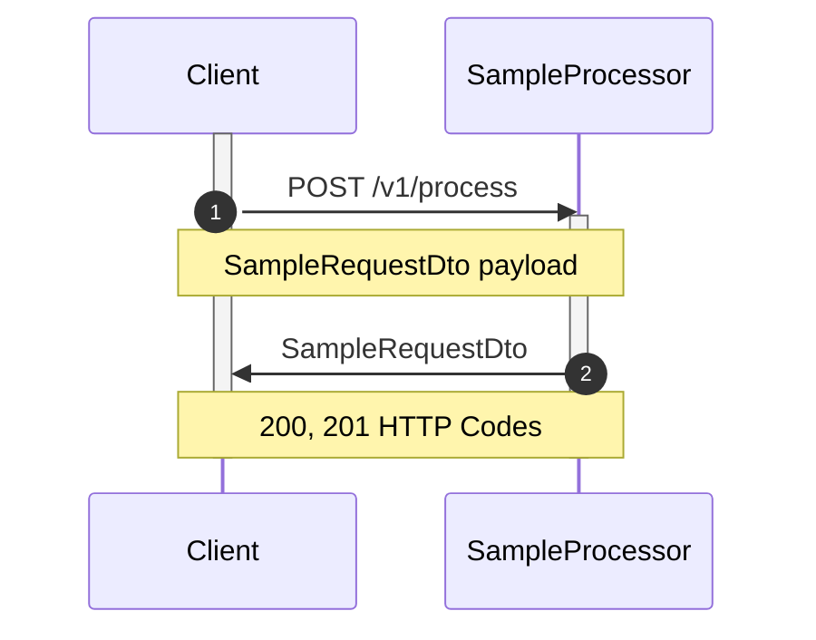
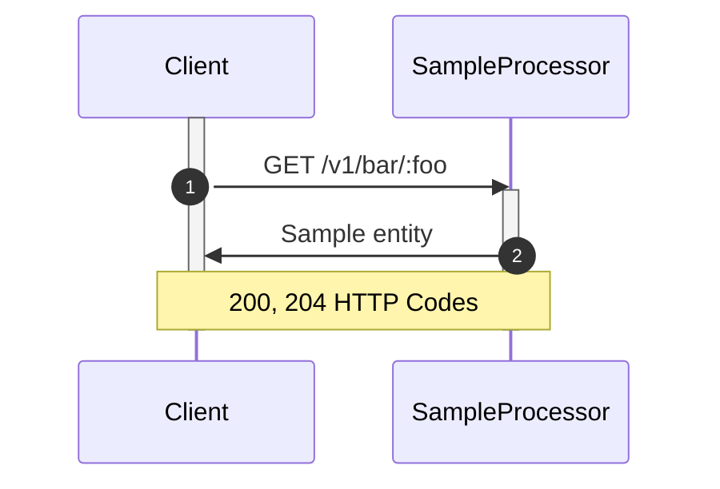

# Microservice Template

Use it to start making a HTTP REST API or Microservice

~"microservice-template"

**Status**: Active

## Overview
The template consists of
1. The Main [Fastify](https://github.com/fastify/fastify) based, and the Console bootstrap  applications
2. Sample Module with Controller and Provider
3. Unit tests
4. Dockerized Integration tests with migrations
5. Interface
6. DTO
7. Exception
8. Interceptor
9. Database with migrations
10. Custom Config
11. Custom Logger
12. Custom Cache
13. Health based on Terminus
14. Custom CLI Command for generating HTTP API JSON Schema
15. CI/CD to publish in into internal application repository [Verdaccio](https://github.com/verdaccio/verdaccio)
16. package.json with scripts
17. Prettier, Typescript compiler, and ESLint settings 
18. Auto-changelog
19. Readme.md

Please, read [this guide](/public/guide/) to get detailed information regarding items.

## Sequence Diagrams

  




## Quick start from scratch
Clone files from this repo to Your Project folder
```git
git clone --bare https://github.com/pashkash/nestjs-microservice-example-guide.git
cd nestjs-microservice-example-guide
yarn install
yarn run start
```

## Detailed documentation
1. [REST API Swagger autogenerated docs](/public/openapi-schema.json) - describes REST API
2. [REST API ReDoc autogenerated docs](/public/redoc.html) - describes classes and methods

## Data Transfer Objects (DTO) Complex Structures
1. For clarity, below is a graphical view of the sample data structure.  
 

## Tests
### Unit
```
yarn run test
```
or
```
yarn run test:unit
```  
Also, you can force to restart test after you change the code with
```
yarn run test:unit:watch
```

### Integration
```
yarn run test:integration
```
It will start docker which  
1. Clone current Devbox database structure 
2. Apply current project migrations
3. Run integration tests

## Troubleshooting & FAQ
1. How I can update index.dto.svg manually?  
`yarn run generate:dto:svg`

## Known issues
1. No temporary tables for Integration tests; No migration example 
2. No system tests with Environment simulator example
3. Console should be a core package
4. Health should be a core package
5. Config should be a core package

## Built with
1. [NestJS](http://nestjs.com/) - A progressive Node.js framework for building efficient, reliable and scalable server-side applications.
2. Custom Logger - Logger module based in Winston Logger 
3. Custom Config - Config module based in Winston Logger
4. Custom Cache - Cache module based in Winston Logger  
  
**Updated 23.8.2020**

