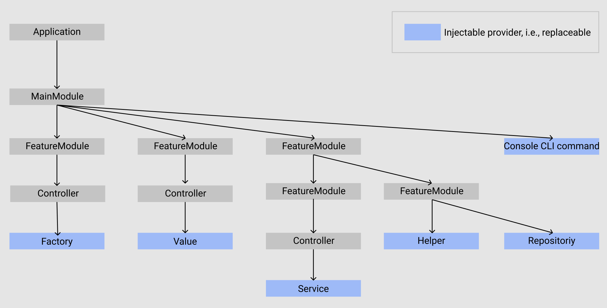

# Creating a NestJS project

In this guide we are going to develop an HTTP REST API Service that allows us to store and fetch some data and call it "My project". This guide going to be detailed enough to cover all what your may need to make any API service.  

## Clone and run the service

Clone the [microservice-template](https://github.com/pashkash/nestjs-microservice-example-guide)
```
git clone --bare https://github.com/pashkash/nestjs-microservice-example-guide.git
cd nestjs-microservice-example-guide
yarn install
yarn run start
```

## Describe project file structure

Let's go over this project structure with `tree ./ -a -C -L 2 --dirsfirst` including obvious explanations 

```bash
./
├── docker-scripts          # docker environment for integration tests
│   ├── .env -> ../.env 
│   ├── db-init-script.sh   # dumps database schema from Devbox into init.sql file   
│   └── init.sql            # postgres container restore this file at the start  
├── public                  # provides static files using by documentations
│   ├── index.dto.svg       # visualize DTO structures and relations
│   ├── openapi-schema.json # OpenAPI schema, can be rendered by the GitLab
│   └── redoc.html          # ReDoc, alternative way to codegen API Documentation   
├── src                     
│   ├── commands            # provides CLI commands for nestjs-console module
│   ├── components          # root-level and shared components, e.g., SwaggerDocumentBuilder
│   ├── config              # NestJS config files for modules, services, etc.
│   ├── controllers         # root-level and shared controllerts, e.g., MainController
│   ├── dto                 # root-level and shared DTOs, e.g., ErrorResponseDto
│   ├── exception-filters   # root-level and shared exception filters, e.g., EveryExceptionFilter
│   ├── exceptions          # root-level and shared exceptions, e.g., ValidationError
│   ├── interceptors        # root-level and shared interceptors, e.g., EmptyResponseInterceptor
│   ├── interfaces          # root-level or shared interfaces, e.g., IProcessor
│   ├── migrations          # typeORM migration files
│   ├── modules             # list of modules packed into folders 
│   ├── services            # root-level and shared services, e.g., MainService
│   ├── MainModule.ts       # app root module, manages application basis structure
│   ├── console.ts          # provides CLI feature with nestjs-console module 
│   └── main.ts             # root app, this file you run to run the app
├── test                    # list modules folders with tests inside
│   └── sample-processor    # tests for 'sample-processor' module
├── .env                    # environment variables
├── .eslintignore           # list folders and files to be skiped by lint check
├── .eslintrc.js            # linter config
├── .gitignore              # listed files and folders will be ignored by git
├── .gitlab-ci.yml          # GitLab CI/CD pipelines config
├── .prettierrc             # code formatter config 
├── .yarnrc                 # list @custom yarn registies
├── CHANGELOG.md            # autogenerated changelog
├── Dockerfile              # main application image, used by docker-compose.yml
├── docker-compose.yml      # compose environment and run integration tests
├── jest.integration.json   # integration tests config file
├── jest.unit.json          # unit tests config file
├── nest-cli.json           # NestJS command-line interface, e.g. for 'nest g' command
├── package.json            # title, dependencies, scripts, and other metadata 
├── tsconfig.build.json     # 'tsc' typescript compiler config file
├── tsconfig.json           # 'tsc' typescript compiler config file
```

You can run it with 
```
yarn install
yarn run start
```
to see how it will up
```
[NestWinston] info	8/12/2020, 4:34:04 PM [NestFactory] Starting Nest application... - {"tags":{"os.name":"Darwin","os":"19.6.0","runtime":"v13.8.0"}}
[NestWinston] info	8/12/2020, 4:34:05 PM [InstanceLoader] TypeOrmModule dependencies initialized - {"tags":{"os.name":"Darwin","os":"19.6.0","runtime":"v13.8.0"}}
[NestWinston] info	8/12/2020, 4:34:05 PM [InstanceLoader] HttpModule dependencies initialized - {"tags":{"os.name":"Darwin","os":"19.6.0","runtime":"v13.8.0"}}
[NestWinston] info	8/12/2020, 4:34:05 PM [InstanceLoader] ConfigHostModule dependencies initialized - {"tags":{"os.name":"Darwin","os":"19.6.0","runtime":"v13.8.0"}}
[NestWinston] info	8/12/2020, 4:34:05 PM [InstanceLoader] TerminusModule dependencies initialized - {"tags":{"os.name":"Darwin","os":"19.6.0","runtime":"v13.8.0"}}
[NestWinston] info	8/12/2020, 4:34:05 PM [InstanceLoader] ConsoleModule dependencies initialized - {"tags":{"os.name":"Darwin","os":"19.6.0","runtime":"v13.8.0"}}
[NestWinston] info	8/12/2020, 4:34:05 PM [InstanceLoader] ConfigModule dependencies initialized - {"tags":{"os.name":"Darwin","os":"19.6.0","runtime":"v13.8.0"}}
[NestWinston] info	8/12/2020, 4:34:05 PM [InstanceLoader] MainModule dependencies initialized - {"tags":{"os.name":"Darwin","os":"19.6.0","runtime":"v13.8.0"}}
[NestWinston] info	8/12/2020, 4:34:07 PM [InstanceLoader] ConfigCoreModule dependencies initialized - {"tags":{"os.name":"Darwin","os":"19.6.0","runtime":"v13.8.0"}}
[NestWinston] info	8/12/2020, 4:34:07 PM [InstanceLoader] ConfigModule dependencies initialized - {"tags":{"os.name":"Darwin","os":"19.6.0","runtime":"v13.8.0"}}
[NestWinston] info	8/12/2020, 4:34:07 PM [InstanceLoader] ConfigModule dependencies initialized - {"tags":{"os.name":"Darwin","os":"19.6.0","runtime":"v13.8.0"}}
[NestWinston] info	8/12/2020, 4:34:07 PM [InstanceLoader] LoggerModule dependencies initialized - {"tags":{"os.name":"Darwin","os":"19.6.0","runtime":"v13.8.0"}}
[NestWinston] info	8/12/2020, 4:34:09 PM [InstanceLoader] TypeOrmCoreModule dependencies initialized - {"tags":{"os.name":"Darwin","os":"19.6.0","runtime":"v13.8.0"}}
[NestWinston] info	8/12/2020, 4:34:09 PM [InstanceLoader] TypeOrmModule dependencies initialized - {"tags":{"os.name":"Darwin","os":"19.6.0","runtime":"v13.8.0"}}
[NestWinston] info	8/12/2020, 4:34:09 PM [InstanceLoader] SampleProcessorModule dependencies initialized - {"tags":{"os.name":"Darwin","os":"19.6.0","runtime":"v13.8.0"}}
[NestWinston] info	8/12/2020, 4:34:09 PM [RoutesResolver] HealthController {/health}: - {"tags":{"os.name":"Darwin","os":"19.6.0","runtime":"v13.8.0"}}
[NestWinston] info	8/12/2020, 4:34:09 PM [RouterExplorer] Mapped {/health, GET} route - {"tags":{"os.name":"Darwin","os":"19.6.0","runtime":"v13.8.0"}}
[NestWinston] info	8/12/2020, 4:34:09 PM [RoutesResolver] MainController {}: - {"tags":{"os.name":"Darwin","os":"19.6.0","runtime":"v13.8.0"}}
[NestWinston] info	8/12/2020, 4:34:09 PM [RouterExplorer] Mapped {, GET} route - {"tags":{"os.name":"Darwin","os":"19.6.0","runtime":"v13.8.0"}}
[NestWinston] info	8/12/2020, 4:34:09 PM [RoutesResolver] SampleProcessorController {/v1}: - {"tags":{"os.name":"Darwin","os":"19.6.0","runtime":"v13.8.0"}}
[NestWinston] info	8/12/2020, 4:34:09 PM [RouterExplorer] Mapped {/v1/process, POST} route - {"tags":{"os.name":"Darwin","os":"19.6.0","runtime":"v13.8.0"}}
[NestWinston] info	8/12/2020, 4:34:09 PM [RouterExplorer] Mapped {/v1/bar/:foo, GET} route - {"tags":{"os.name":"Darwin","os":"19.6.0","runtime":"v13.8.0"}}
[NestWinston] info	8/12/2020, 4:34:09 PM [NestApplication] Nest application successfully started - {"tags":{"os.name":"Darwin","os":"19.6.0","runtime":"v13.8.0"}}
[NestWinston] info	8/12/2020, 4:34:09 PM [NestApplication] Environment: "development" - {"tags":{"os.name":"Darwin","os":"19.6.0","runtime":"v13.8.0"}}
[NestWinston] info	8/12/2020, 4:34:09 PM [NestApplication] Application running on: "http://0.0.0.0:8888" - {"tags":{"os.name":"Darwin","os":"19.6.0","runtime":"v13.8.0"}}
```
Try it with
```
curl http://localhost:8888
```
to get 
```
{"status":"OK"}
```
Great.  
You've got a working HTTP REST API service. You don't know yet what this application does and how it is working.  
Read the logs above to see the startup sequence. A NestWinston logger prints that a NestFactory starts to create the application, an InstanceLoader discovers and initializes dependencies, a RouterExplorer with a RoutesResolver maps routes. Finally, NestApplication starts to listen to the address http://0.0.0.0:8888. You can even notice the exact routes the application has. 

But, before we go more in-depth and explain project files, we will learn the main elements for making a NestJs application.


## Elements
Any NestJs application consists of
* Applications
* Modules
* Controllers
* Providers

The hierarchy is: Application -> Module -> Controller -> Provider. 
It means that the Application instantiates the MainModule, MainModule organizes relations between Sub-modules, Controllers, and Providers. Finally, Controllers always instantiate Providers but not vice versa. Providers implement features.
  
With these four elements, you can draft the structure of an application you want. 

> Please, note that **this draft of application graph reflects relations between Interfaces/Types, conceptually.** This point of view pushes the application toward to be SOLID, always ready to refactor, test, and new features. For example, we can replace the Recommendation engine based on Elastic Search with another based on Machine Learning algorithm realizations by changing only an `import` because both provide the same abstraction. The application continues to work as designed. Or you can use Express HTTP Server instead of Fastify. Replaceable and reusable between applications is easy to use.  

### Application
The `main.ts` file is the entry point of the application. By run `yarn run start` you literally run `nest start main` mapped inside `package.json`. Thus, you tell NestsJs to build and launch the `main` application.  
You are able to create more application files and run each of them with `nest start another-app`.

Under the hood, application file asks for `NestFactory` to create the instance that implements the `INestApplication` interface. `NestFactory` needs a Module argument. 
The minimal application file can be described by this snippet:
```typescript
import { NestFactory } from '@nestjs/core';
import { MainModule } from './MainModule';

async function bootstrap() {
  const app = await NestFactory.create(MainModule);
  await app.listen(8888);
}
bootstrap();
```
### Module
The module encapsulates the feature.  
Technically the module file exports the only one class decorated with `@Module()`. With this decorator, developer organizes the relations and dependencies for the feature implementation.

| Object |  |
| -------- | -------- |
| `imports`      | The list of required modules; their providers will export |
| `controllers`      | The list of controllers defined in this module to be instantiated |
| `providers`      | The list of providers to be instantiated and shared across this module     |
| `exports`      | The list of providers that this module implements should be available in other modules if they import this module     |

This minimal module instantiates `MainController` and registers `MainService` thus it can be used across this module.
```typescript
import { Module } from '@nestjs/common';
import { MainController } from './controllers/MainController';
import { MainService } from './services/MainService';

@Module({
  imports: [],
  controllers: [MainController],
  providers: [MainService],
  exports: [],
})
export class AppModule {}
```


### Controller
The controller is responsible for handling incoming requests and returning responses to the client. The primary purpose is to provide routing, and delegate processing requests to the providers.  
Technically, the controller is a class annotated with an `@Controller()` decorator. By decorating the controller's methods with, for example, `@Get()` or `@Post()`, we can manage the routing rules and support route patterns.


In this example `MainController`  
1. creates a `mainService` provider instance based on `MainService` class and makes it available with `this.mainService` automatically for us; it's a pivotal moment: you do not create an instance, NestJS does it for you and passes it to the constructor; thus you can use `SuperMainService` if it realizes the same interface as `MainService` and your code will keep working
2. provides route `GET /` to return `mainService.getStatus()` value
3. responses with json contains `string` typed `status` key

```typescript
import { Controller, Get } from '@nestjs/common';
import { MainService } from './services/MainService';

@Controller()
export class MainController {
  constructor(private readonly mainService: MainService) {}

  @Get()
  getStatus(): { status: string } {
    return this.mainService.getStatus();
  }
}
```

### Provider
This element contains complex business logic.  
Technically, the provider is a class annotated with an @Injectable() decorator. It can be injected into controllers, modules, inside other providers, etc.  

In this example `MainService` returns json object with `{ status: 'OK' }`.

```typescript
import { Injectable } from '@nestjs/common';

@Injectable()
export class MainService {
  getStatus(): { status: string } {
    return { status: 'OK' };
  }
}
```


## Summary
Great, we've made a good start.  
First, we cloned the template NestJS API project and examined its file structure. Our objective is to be able to explain everything in the cloned project.  
Second, we learned the main four elements, and now we can start to assemble our NestJS API service in the next chapter.  


## Reading quality check
1. List the basic elements of the NestJs app.