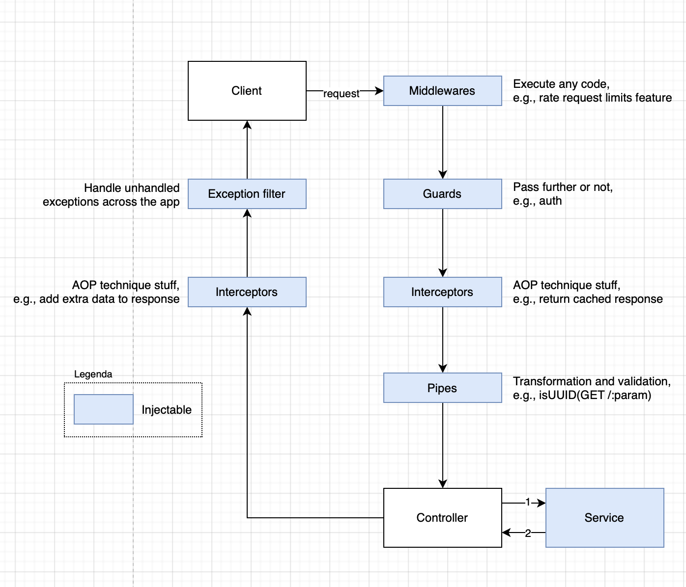

# Apply specific NestJS features and company submodules
In this chapter, we will learn some helpful stuff that NestJS provides for HTTP API developers. Also, we set up custom config, logger and cache submodules. Time to put it all together and understand the app and its main module file entirely.

## Request lifecycle

To understand the application's `main.ts` file fully, let's consider how the [request processes below](https://drive.google.com/file/d/1-BN6VB9lPnqNEvq_9Qm8P305jD20R4ee/view?usp=sharing)  
  
  

### Middleware
Middlewares are able to
- execute any code
- make changes to the request and the response objects
- end the request-response cycle

For example, to bind a [Helmet](https://github.com/helmetjs/helmet) set of middlewares to every registered route at once
```
app.use(helmet());
```

Our sample application has no custom middleware.

### Guards
Guards determine whether a given request will be handled by the route handler or not, depending on certain conditions (like permissions, roles, ACLs, etc.) present at run-time.   

To use guards
```typescript
@Controller()
@UseGuards(ExampleGuard)
export class ExampleController {}
```

Our sample application has no custom guard.


### Interceptors
Interceptors have a set of useful capabilities which are inspired by the Aspect Oriented Programming (AOP) technique. They make it possible to:

- bind extra logic before / after method execution
- transform the result returned from a function
- transform the exception thrown from a function
- extend the basic function behavior
- completely override a function depending on specific conditions (e.g., for caching purposes)


Our sample application has two interceptors:
- custom EmptyResponseInterceptor to update HTTP No Content code if response ie empty
- NestJS ClassSerializerInterceptor to transform all response-entities into DTOs  

To use Interceptor:
```typescript
app.useGlobalInterceptors(new EmptyResponseInterceptor());
app.useGlobalInterceptors(new ClassSerializerInterceptor(app.get(Reflector)));
```


### Pipes
Pipes have two typical use cases:

- transformation: transform input data to the desired form (e.g., from string to integer)
- validation: evaluate input data and if valid, simply pass it through unchanged; otherwise, throw an exception when the data is incorrect

We use ValidationPipe to ensure all endpoints are protected from receiving incorrect data globally and their types synced with DTO schema
```typescript
await app.useGlobalPipes(
  new ValidationPipe({
    transform: true,
  }),
);
```          
  

### Exception filters
When an exception is not handled by your application code, it is caught by this layer, which then automatically sends an appropriate user-friendly response.

We catch all exceptons to be sure that all of them shaped as `ErrorResponseDto`
```typescript
app.useGlobalFilters(new EveryExceptionFilter());
```

### Custom submodules
The app uses modules injected into the Company infrastructure.

#### Config
Provides Custom Config submodule.  
Injected with `CONFIG_SERVICE_INTERFACE_TOKEN` token and can be called 
```typescript
app.get<ConfigServiceInterface>(
  CONFIG_SERVICE_INTERFACE_TOKEN,
);
```
Settings priority: env vars > .env file > Vault.


#### Logger
Provides Custom Logger  submodule.  
Injected with `LOGGER_SERVICE_TOKEN` token and can be used 
```typescript
app
  .get<LoggerInterface>(LOGGER_INTERFACE_TOKEN)
  .log('Logger');
```
Based in Watson. Uses two transports: Console and Sentry.

#### Cache
Provides Cache  submodule.
TODO: Injected with %token% ... 

Based on the abstract cache interface, it uses Redis out of the box as storage. 

## Read the entire  app file
Now we are ready for it
```typescript
async function bootstrap() {
  // create a NestFastifyApplication
  const app = await NestFactory.create<NestFastifyApplication>(
    // use ./MainModule as a root module
    MainModule,
    // use Fastify instead of Express HTTP framework
    new FastifyAdapter(),
    // use custom submodule logger bootstrapped with console transport only 
    {
      logger: LoggerProvider.forBootstrap('info'),
    },
  );
  // get configs to use them as a parameter further
  const configService = app.get<ConfigServiceInterface>(
    CONFIG_SERVICE_INTERFACE_TOKEN,
  );

  // use custom submodule logger but already populated with app configs
  app.useLogger(app.get(LOGGER_SERVICE_TOKEN));
  // allows resources to be requested from another domain
  app.enableCors(); 
  // use EmptyResponseInterceptor
  app.useGlobalInterceptors(new EmptyResponseInterceptor());
  // transform all response-entities into DTOs globally  
  app.useGlobalInterceptors(new ClassSerializerInterceptor(app.get(Reflector)));
  // do both validate and transform all DTO payloads globally  
  await app.useGlobalPipes(
    new ValidationPipe({
      transform: true,
    }),
  );
  // use our own EveryExceptionFilter
  app.useGlobalFilters(new EveryExceptionFilter());

  // generate Swagger HTTP UI
  const document = SwaggerDocumentBuilder.create(app);
  SwaggerModule.setup('api', app, document);

  // start the app listen 
  await app.listen(
    configService.get<number>('APP_PORT') as number,
    configService.get<string>('APP_HOST') as string,
  );

  // print custom logs
  app
    .get<LoggerInterface>(LOGGER_INTERFACE_TOKEN)
    .log(
      `Environment: \x1b[1m"${configService.get('app.environment')}"\x1b[0m`,
      'NestApplication',
    );
  app
    .get<LoggerInterface>(LOGGER_INTERFACE_TOKEN)
    .log(
      `Application running on: \x1b[1m"http://${configService.get(
        'APP_HOST',
      )}:${configService.get('APP_PORT')}"\x1b[0m`,
      'NestApplication',
    );
}
bootstrap();
```

## Read the entire root module file
Reading the file with the settings of the root module the first time can be difficult as well, so here is the explanation
```typescript
@Module({
  // config submodule settings
  imports: [
    // register ConfigModule's provider for the root module and inject
    // configService instance what will be available by submodule's exported  
    // CONFIG_SERVICE_INTERFACE_TOKEN for other submodules
    ConfigModule.forRoot({
      // load donfogs from src/config folder
      load: [app, services, databases, vault],
      // set env files to be loaded
      envFilePath: ['.env.local', '.env'],
      // share with other modules, no need to import ConfigModule for them
      isGlobal: true,
      // validate critical parameters
      validationSchema: Joi.object({
        NODE_ENV: Joi.string()
          .valid('development', 'production', 'test')
          .default('development'),
        SENTRY_DSN: Joi.string(),
      }),
    }),

    // going to async instantiate dynamic module LoggerModule
    LoggerModule.forRootAsync({
      // import dependencies
      imports: [ConfigModule],
      // use factory for creating and then injecting LoggerModule instance
      useFactory: (
        configService: ConfigServiceInterface,
      ): LoggerModuleOptions => {
        const aTransports = [];
        // add sentry logs in case of production environment
        if (configService.get('app.environment') === 'production') {
          aTransports.push(
            new SentryTransport({
              level: 'warn',
              sentryOpts: {
                dsn: configService.get<string>('services.sentry.dsn'),
                release: configService.get<string>('app.version'),
                environment:
                  configService.get<string>('app.environment') || 'development',
                serverName: configService.get<string>('app.hostname'),
              },
              handleExceptions: true,
            }),
          );
        }
        // parameters to create a LoggerModule instance
        return {
          debug: configService.get('app.debug'),
          environment: configService.get('app.environment'),
          transports: aTransports,
          defaultContext: 'NestApplication',
        };
      },
      // will be injected inside context of the factory
      inject: [CONFIG_SERVICE_INTERFACE_TOKEN],
    }),

    // going to async instantiate dynamic module TypeOrmModule module
    TypeOrmModule.forRootAsync({
      // import dependencies
      imports: [ConfigModule],
      // use factory for creating and then injecting Postgres typed TypeOrmModule
      useFactory: async (configService: ConfigServiceInterface) =>
        // parameters for the factory
        configService.get<TypeOrmModuleOptions>('databases.postgres'),
      // will be injected inside context of the factory
      inject: [CONFIG_SERVICE_INTERFACE_TOKEN],
    }),

    // going to async instantiate dynamic module TypeOrmModule module
    TypeOrmModule.forRootAsync({
      // import dependencies
      imports: [ConfigModule],
      // use factory for creating and then injecting Postgres typed TypeOrmModule
      useFactory: async (configService: ConfigServiceInterface) =>
        // parameters for the factory
        configService.get<TypeOrmModuleOptions>('databases.postgres'),
      // will be injected inside context of the factory
      inject: [CONFIG_SERVICE_INTERFACE_TOKEN],
    }),
    // register modules without parameters
    SampleProcessorModule,
    TerminusModule,
    ConsoleModule,
  ],
  // instantiate controllers
  controllers: [HealthController, MainController],
  // instantiate and share these providers across the module 
  providers: [MainService, Logger, GenerateCommand],
  // nothing extra for other modules 
  exports: [],
})
export class MainModule {}
```

## Summary
Great! We developed the HTTP REST API service. Next chapter we run tests, lint the code and launch the app.  

## Reading quality check
1. Why there is no test about wrong validation data? 
2. Try to explain `SwaggerDocumentBuilder.ts` and `GenerateCommand` files.
3. Try to put all three chapters together.